# JF-Verwaltung — Handbuch mit Bildern

Ein Rundgang durch alle Seiten der Software. Wer wissen will, wie die Software
*eingerichtet* wird, findet das im [README](../README.md) — hier geht es darum, was man
damit macht.

> **Alle Namen, Größen und Einschätzungen auf diesen Bildern sind erfunden.** Sie stammen aus
> einem Demo-Bestand, den [`scripts/doku-daten.js`](../scripts/doku-daten.js) erzeugt. In einem
> öffentlichen Repository haben Namen und Kleidergrößen echter Kinder nichts zu suchen.
> Wie die Bilder entstehen, steht [am Ende](#bilder-neu-aufnehmen).

## Inhalt

- [Der erste Eindruck](#der-erste-eindruck)
- [Der Übungsabend](#der-übungsabend) — Anwesenheit, Einschätzung, Einteilung
- [Spinte und Ausrüstung](#spinte-und-ausrüstung)
- [Das Lager](#das-lager)
- [Drucken: QR-Codes und Etiketten](#drucken-qr-codes-und-etiketten)
- [Mitglieder](#mitglieder)
- [Am Handy](#am-handy)
- [Verwaltung](#verwaltung) — Stammdaten, Betreuer, Sicherung, Update
- [Dieses Handbuch in der Software](#dieses-handbuch-in-der-software)
- [Bilder neu aufnehmen](#bilder-neu-aufnehmen)

---

## Der erste Eindruck

Ohne Anmeldung ist alles gesperrt — bis auf die eine Seite, deren QR-Code man gerade
gescannt hat.

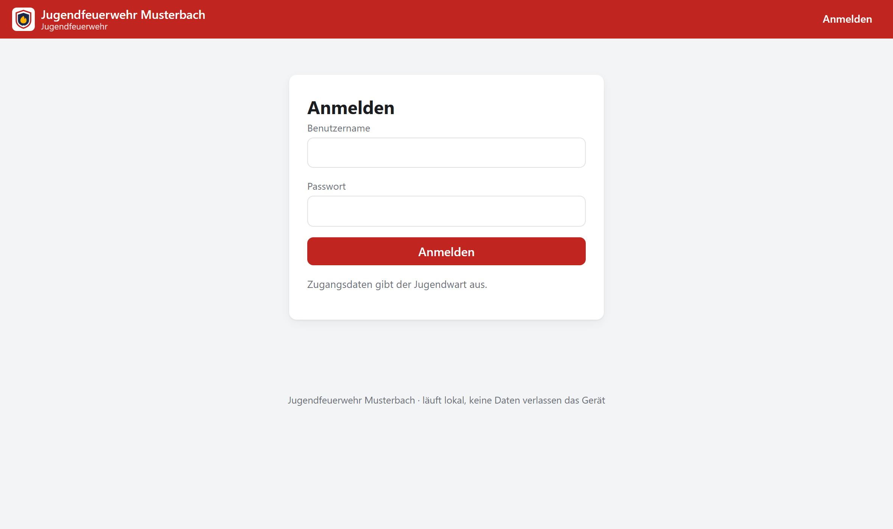

Danach die Übersicht: eine Kachel je Spint, gruppiert nach Umkleidebereich. Auf jeder Kachel
steht, **was drin liegt** — Jacke 158, Hose 158, Helm, Handschuhe 8, Schuhe 39. Freie Spinte
sind blass, und die Kennzahlen oben sagen in einer Zeile, wie es steht. Ein defektes Teil
färbt seine Zahl rot; man muss nicht danach suchen.

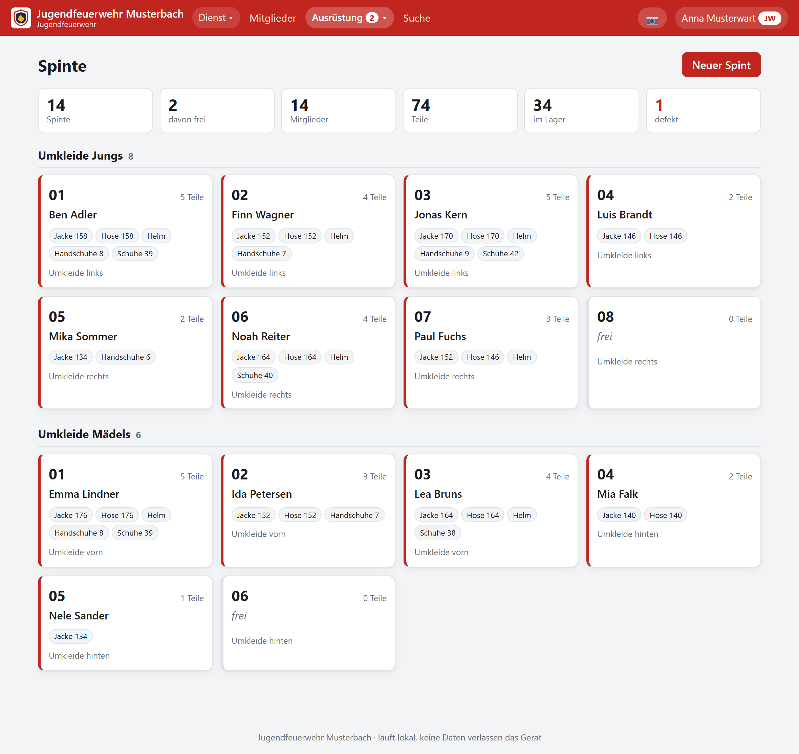

Die Navigation bündelt zwei Bereiche in Untermenüs, sonst bräche die Leiste am Handy über
drei Zeilen um. **Dienst** ist alles, was man am Übungsabend braucht, **Ausrüstung** die
Verwaltung der Sachen. Die Zahl neben „Ausrüstung" sind die offenen Aufgaben.

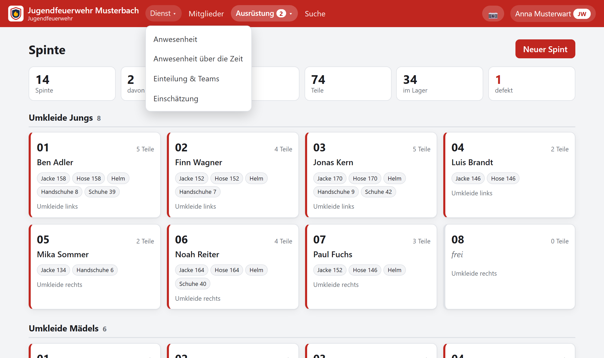

---

## Der Übungsabend

### Anwesenheit

Ein Tipp je Kind, und der sitzt sofort — es gibt nichts zu speichern. Antippen wechselt
durch **da → entschuldigt → fehlt → offen**.

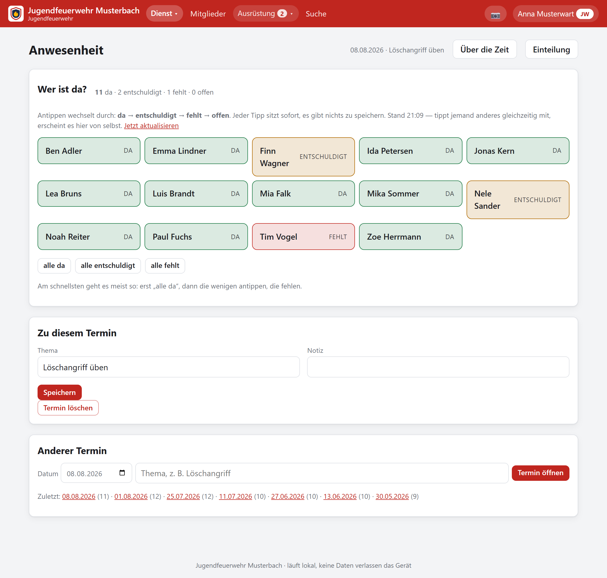

Zwei Dinge, die im Bild stecken und im Betrieb zählen:

* **„alle da", dann die wenigen antippen, die fehlen.** Das ist der schnellste Weg, und
  meist stimmt es nach drei Tippern.
* **Mehrere Betreuer gleichzeitig** sind kein Problem. Die Seite holt sich alle 15 Sekunden
  den Stand der anderen, und ein Tipp schickt *den Zielzustand* — nicht „einen weiter".
  Sonst könnte eine veraltete Seite jemandes „da" versehentlich zu „entschuldigt" machen.

„Offen" ist absichtlich etwas anderes als „fehlt": am Anfang des Abends ist noch nichts
erfasst, und das ist keine Aussage über die Kinder.

### Anwesenheit über die Zeit

Wer kommt regelmäßig, wer schleicht sich raus? Die Quote je Kind über alle Termine, dazu
die Beteiligung je Abend.

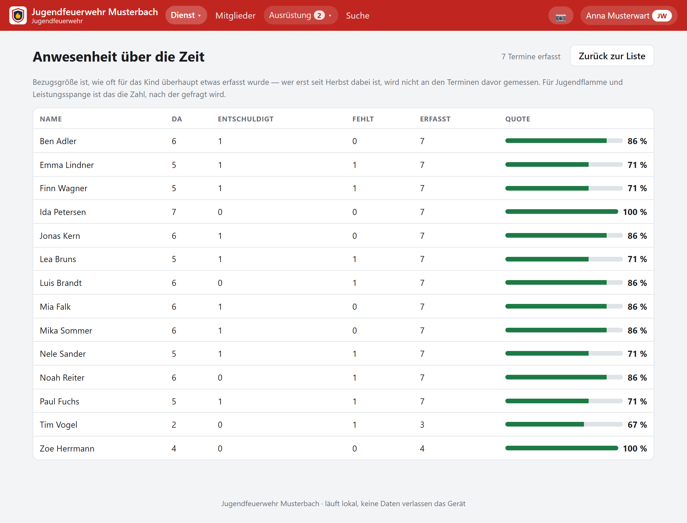

### Einschätzung

Grundlage für ausgeglichene Einteilungen — und der heikelste Teil der Software. Die Seite
kommt deshalb **zugeklappt** hoch:

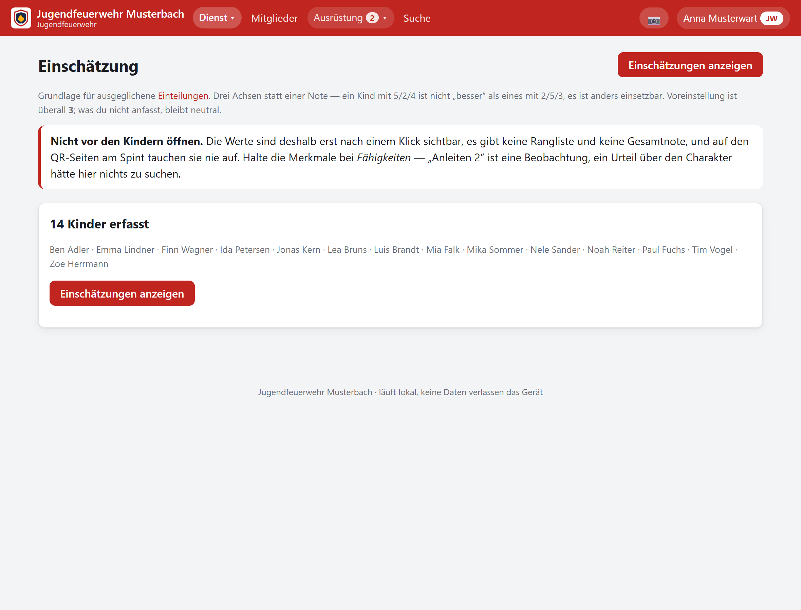

Das ist kein Zierrat. Wenn Kinder neben dem Tablet stehen, soll auf dem Bildschirm nichts
über sie stehen. Erst ein Klick öffnet die Werte.

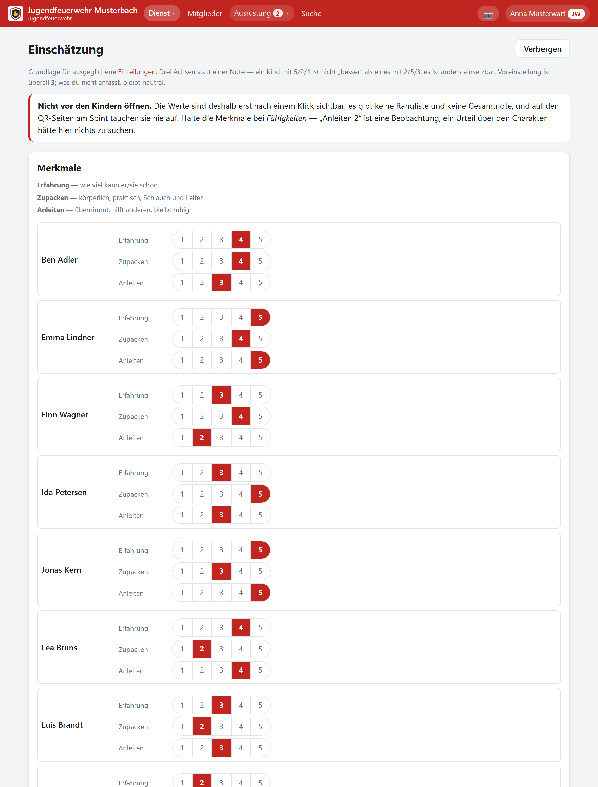

**Drei Achsen statt einer Note**, je 1–5:

| Achse | Frage |
|---|---|
| Erfahrung | Wie viel kann er/sie schon? |
| Zupacken | Körperlich, praktisch, Schlauch und Leiter |
| Anleiten | Übernimmt, hilft anderen, bleibt ruhig |

Eine einzelne Zahl wäre eine Rangliste, und genau die soll hier nicht entstehen. Ein Kind
mit 5/2/4 ist nicht „besser" als eines mit 2/5/3 — es ist **anders einsetzbar**. Es gibt
keine Gesamtnote, keine Sortierung nach Punkten, und auf den QR-Seiten am Spint tauchen die
Werte nie auf. Auch die API gibt sie nicht heraus. Voreingestellt ist überall 3; was man nicht
anfasst, bleibt neutral.

Ein Klick setzt einen Wert — kein Speichern-Knopf, kein Formular.

### Wer kann welche Funktion?

Gruppenführer kann nicht jeder, und das lässt sich nicht wegrechnen. Wichtig ist die
**zweite Stufe**: `übt` heißt „soll das lernen, schau hin". Ohne sie bekämen immer dieselben
zwei Kinder den Gruppenführer, und niemand sonst lernte es je.

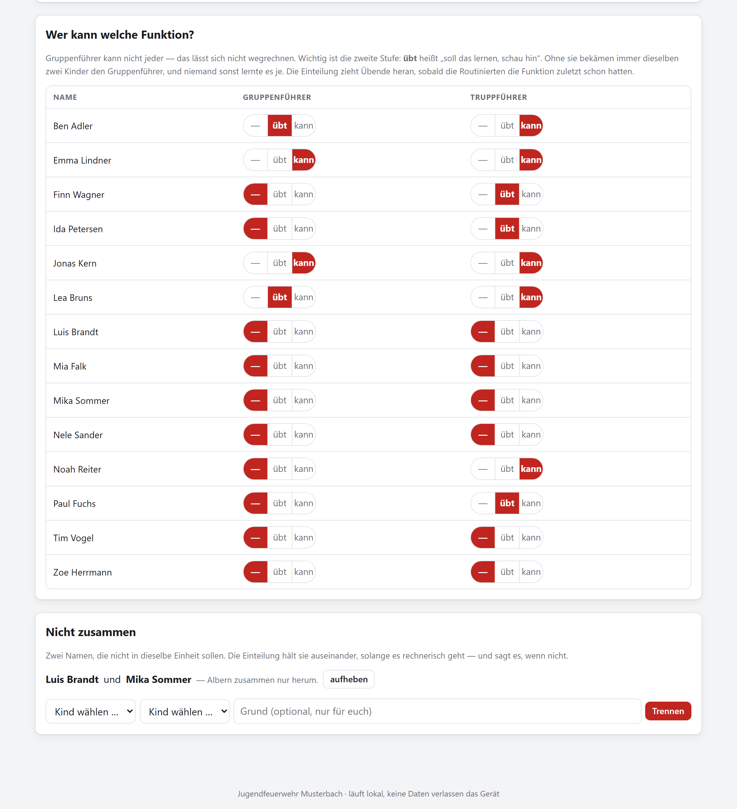

Darunter **„Nicht zusammen"**: zwei Namen, die nicht in dieselbe Einheit sollen. Die
Einteilung hält sie auseinander, solange es rechnerisch geht — und sagt es, wenn nicht.

### Einteilung

Aus der Anwesenheit von heute werden Einheiten. Die Aufstellungen folgen der FwDV 3:
**Gruppe** (9), **Staffel** (6), **Trupp** (3) oder freie Einteilung ohne Funktionen.

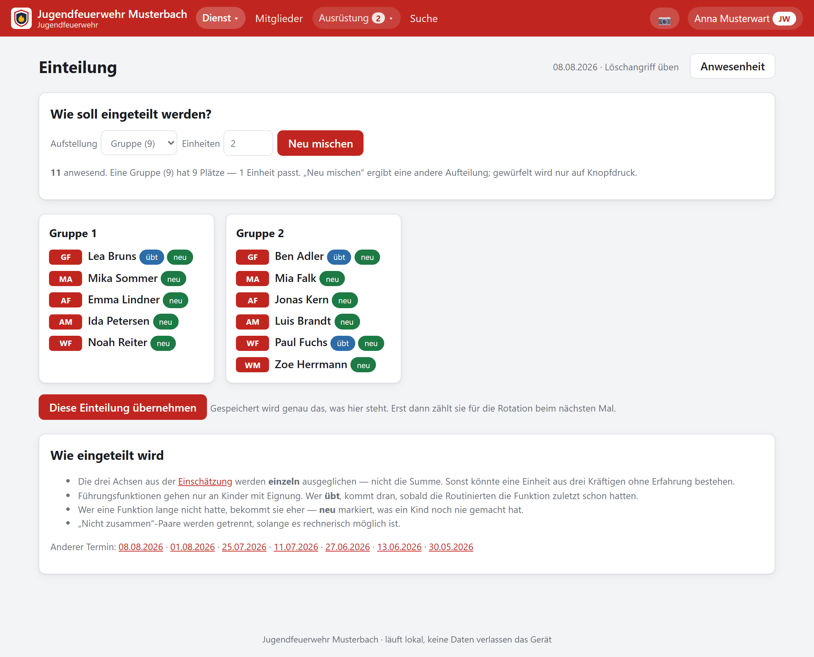

Die Kürzel sind die aus der Feuerwehr: **GF** Gruppenführer, **MA** Maschinist, **Me**
Melder, **AF/AM** Angriffstrupp, **WF/WM** Wassertrupp, **SF/SM** Schlauchtrupp.

Was das Bild zeigt, wenn man genau hinsieht: den GF haben diesmal **Lea Bruns** und **Ben
Adler** — beide `übt`. Die beiden Routinierten (Jonas Kern, Emma Lindner) hatten die
Funktion beim letzten Mal, also kommen die Übenden dran. Genau dafür ist die zweite Stufe da.
`neu` markiert, was ein Kind noch nie gemacht hat.

Der **Maschinist** ist bewusst *keine* kritische Rolle: fahren und pumpen machen die
Betreuer, das Kind assistiert. Das ist der Platz für jemanden, der schnuppert — dort gibt es
in der Regel eine 1-zu-1-Betreuung.

Gewürfelt wird nur auf Knopfdruck. Sonst stünde bei jedem Aufruf eine andere Einteilung da
als die, die man gerade vorgelesen hat. Gespeichert wird genau das, was auf dem Schirm
steht — erst dann zählt es für die Rotation beim nächsten Mal.

---

## Spinte und Ausrüstung

### Ein Spint

Alles zu einem Spint auf einer Seite: wer ihn benutzt, was drin liegt, was noch fehlt.

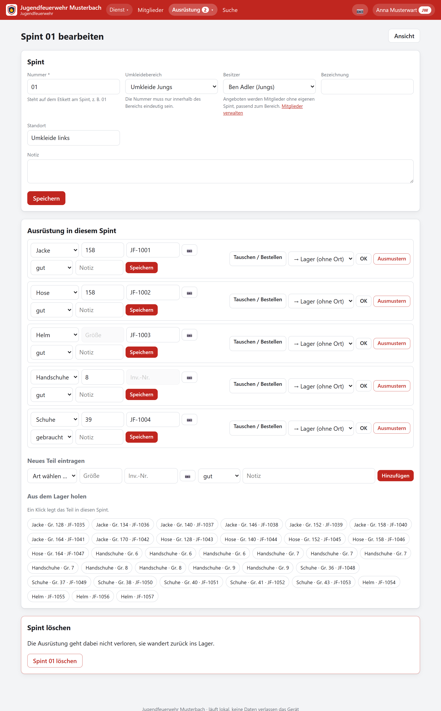

Die Auswahl „Neues Teil eintragen" ist zweigeteilt: oben, **was noch fehlt**, unten, was
schon im Spint liegt. So greift man am Spint nicht versehentlich zur zweiten Jacke.

### Der QR-Code am Spint

Das Ziel des Aufklebers an der Spinttür — ohne Anmeldung erreichbar, weil die Kinder und
ihre Eltern kein Passwort haben.

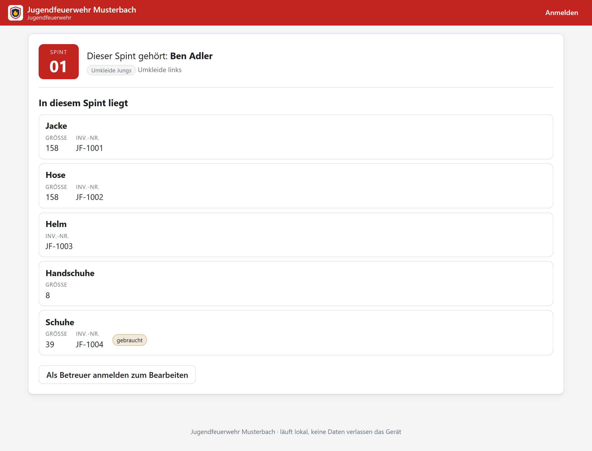

Diese Seite zeigt **nur ihr eigenes** Mitglied und ihren eigenen Inhalt. Keine Navigation,
kein Link, der irgendwo anders hinführt — nur „Anmelden". Deshalb steht im QR-Code auch
nicht die laufende Nummer, sondern ein zufälliger Token (`/s/t8exz96cepde` statt `/s/1`):
sonst könnte jeder im WLAN von einem Etikett auf alle anderen schließen und hätte Namen und
Kleidergrößen aller Jugendlichen.

Lagerorte haben denselben Mechanismus:

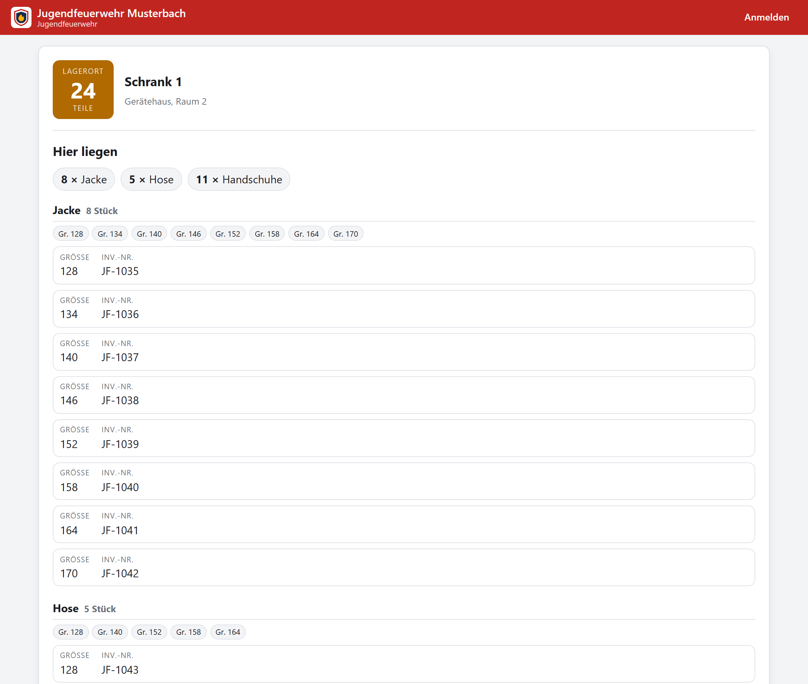

### Tauschen und Bestellen

Das häufigste Ereignis im Betrieb: ein Kind ist aus der Jacke gewachsen.

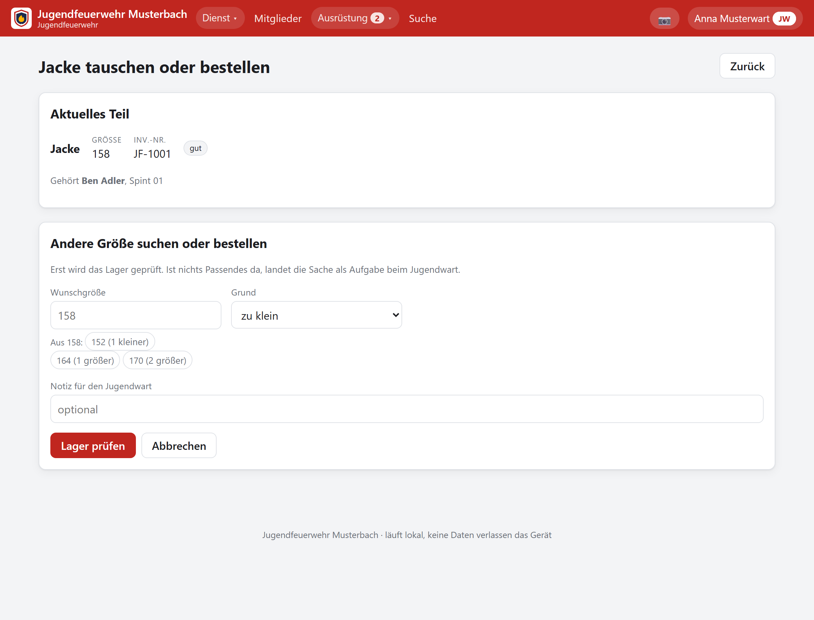

Die Software sucht zuerst im Lager. Liegt dort etwas Passendes, wird getauscht und der Ort
genannt. Liegt nichts da, entsteht eine **Bestellung**. Vor dem Tausch kommt eine
Sicherheitsabfrage — es geht ja um ein echtes Teil in einem echten Schrank.

### Aufgaben

Was noch zu tun ist, an einer Stelle. Offene Bestellungen sind auch am Spint sichtbar, damit
nicht der nächste Betreuer dasselbe Paar Handschuhe ein zweites Mal bestellt.

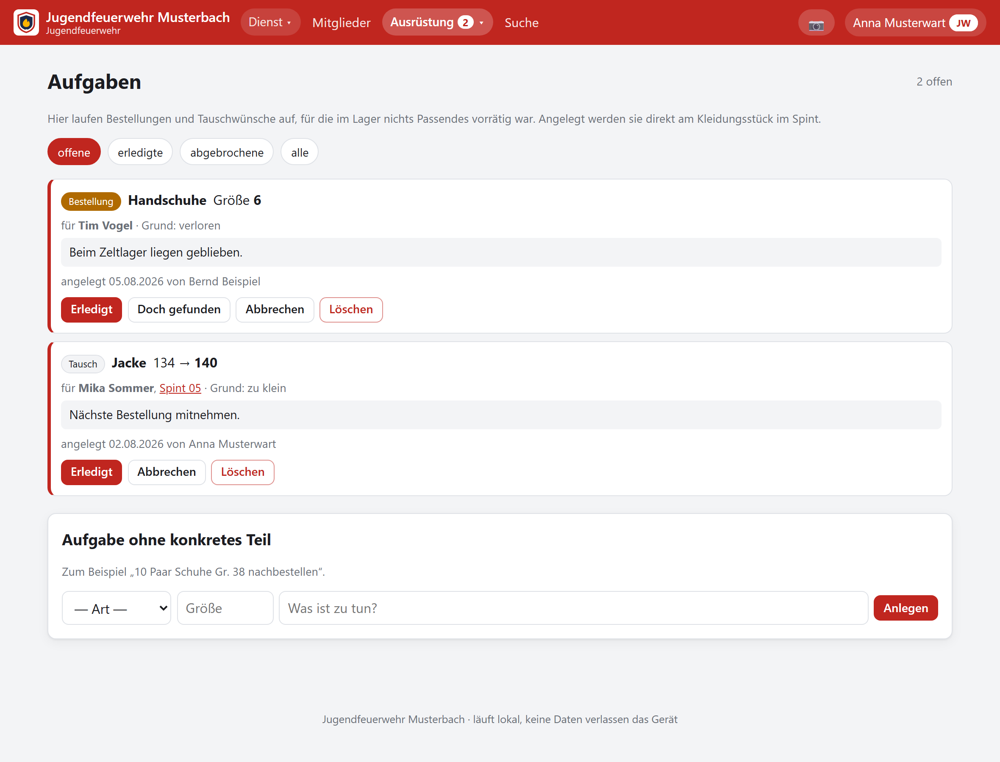

Für verlorene Sachen, die wieder auftauchen, gibt es **„Doch gefunden"**: das nimmt die
Bestellung zurück und legt das ausgemusterte Teil in einem Schritt zurück in den Spint.

### Suche

Ein Feld über alles — Namen, Spintnummern, Größen, Inventarnummern. Mehrere Wörter werden
zusammen gesucht.

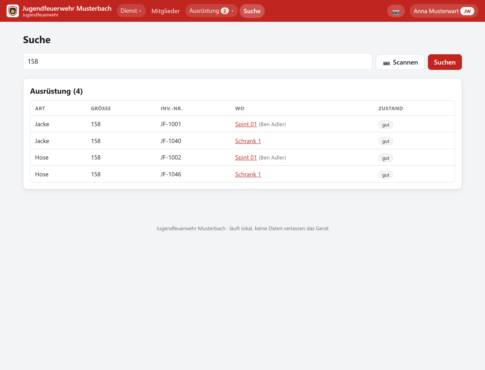

### Ausgemustert

Nichts verschwindet einfach. Ausgemusterte Teile bleiben nachvollziehbar und lassen sich
zurückholen.

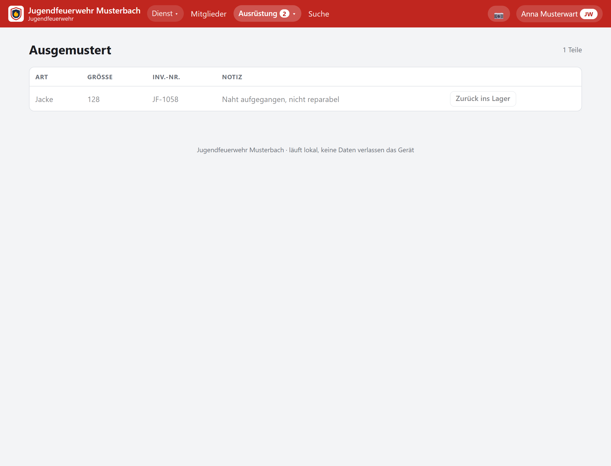

---

## Das Lager

### Einbuchen und Bestand

Zwei Wege hinein, und der Unterschied ist der Alltag:

* **Sammelposten** — mehrere gleiche ohne Nummer. Sechs Paar Handschuhe Größe 8 in einem
  Formular.
* **Einzelteil** — ein Stück mit eigener Inventarnummer, auch scannbar.

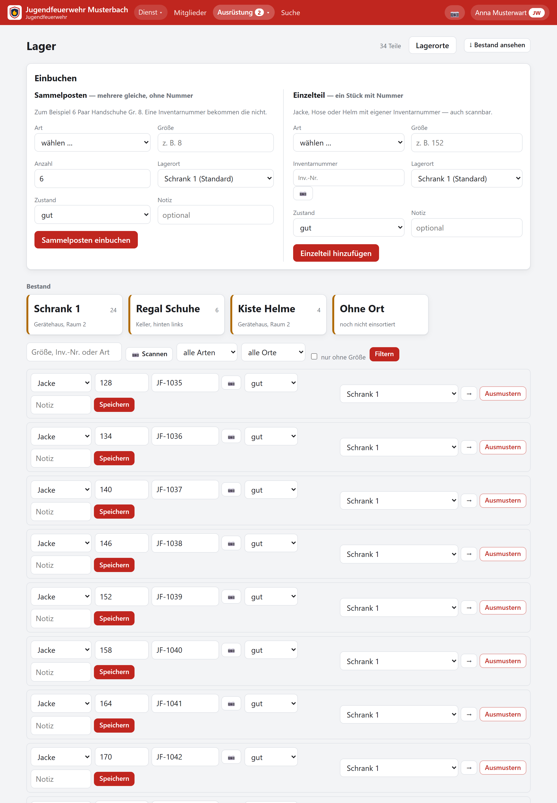

Das Einbuchen steht hier oben, weil dieser Bestand gerade erfasst wird. Ist das erledigt,
schaltet man bei den Lagerorten den **Erfassungsmodus** aus — dann rutscht es nach unten und
der Bestand steht vorn. Der Alltag ist Nachsehen, nicht Einbuchen.

### Lagerorte

Jeder Lagerort bekommt seinen eigenen QR-Code. Einer trägt **Standard**: neue Teile ohne
gewähltes Ziel landen dort.

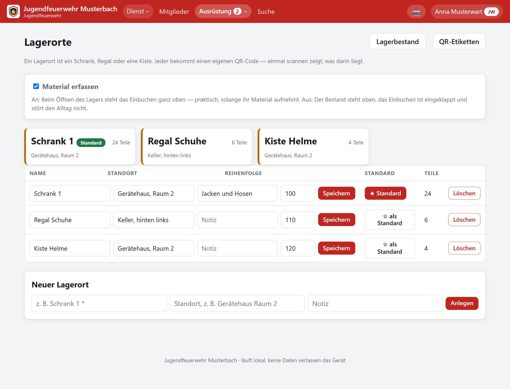

### Arten und Größen

Welche Arten es gibt, welche Größenreihe dazugehört, und welches Barcode-Präfix die
Inventarnummern haben.

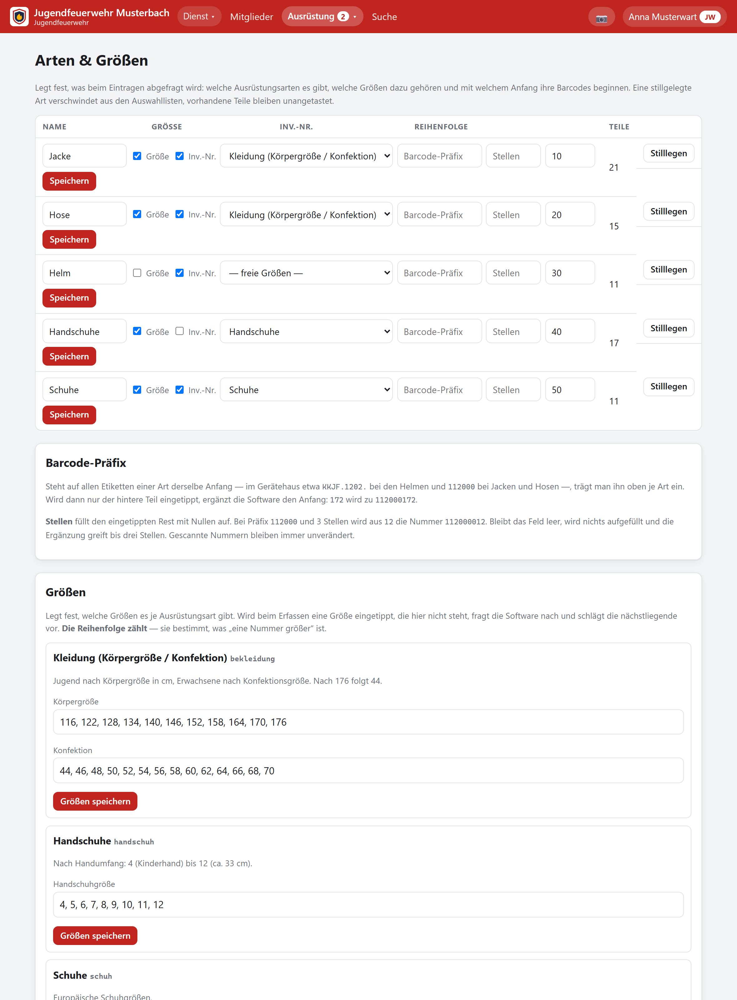

Die Größenreihen sind das Ergebnis von echtem Ärger: Kleidung läuft nach Körpergröße
(116–176 cm) und geht danach in Konfektionsgrößen über — **nach 176 folgt 44**, nicht 182.
Handschuhe und Schuhe haben eigene Reihen. Tippt man eine Größe ein, die es in der Reihe
nicht gibt, fragt die Software nach, statt sie stillschweigend zu übernehmen.

---

## Drucken: QR-Codes und Etiketten

### QR-Aufkleber

Kleine Aufkleber für Spinte und Lagerorte, viele auf ein Blatt.

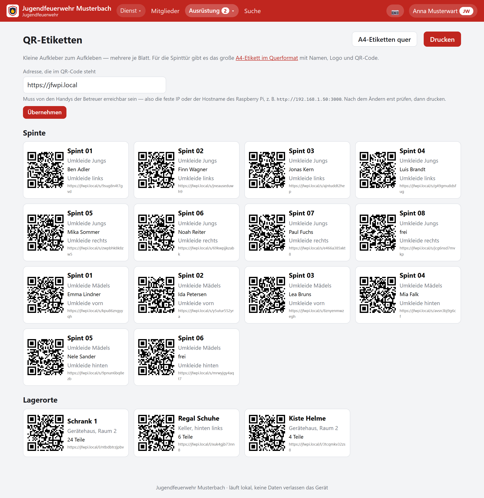

### Das Spint-Etikett

Ein Blatt für die Spinttür: Name der Wehr und Logo oben, der Name des Kindes groß, seitlich
der QR-Code mit dem Hinweis „Was ist hier drin?", unten **JUGENDFEUERWEHR** — damit sich die
Kids von der Kinderfeuerwehr abheben, wenn beide dasselbe Logo tragen.

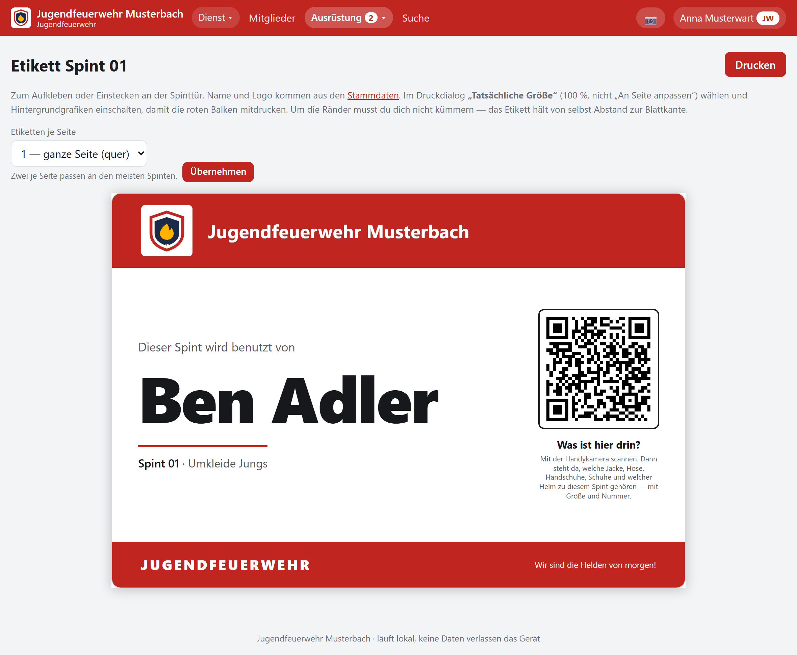

Wichtig ist die Wahl **Etiketten je Seite**. Ein Etikett auf A4 ist an den meisten Spinten
zu groß; zwei je Seite passen. Die Schriftgröße wächst und schrumpft mit, und der Name wird
nach der tatsächlichen Buchstabenbreite umbrochen — „Hofmann" zerreißt nicht mehr, weil
schmale und breite Buchstaben unterschiedlich zählen.

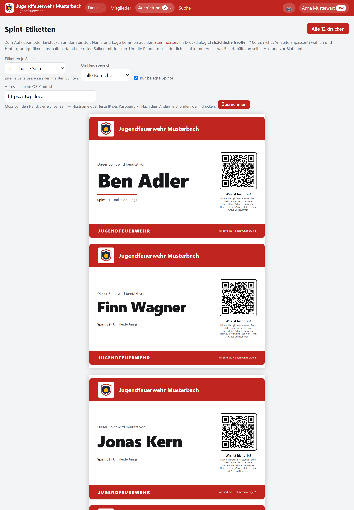

Im Druckdialog **„Tatsächliche Größe"** (100 %, nicht „An Seite anpassen") wählen und
Hintergrundgrafiken einschalten, sonst fehlen die roten Balken. Um die Ränder muss man sich
nicht kümmern — das Etikett hält von selbst Abstand zur Blattkante.

Die Adresse im QR-Code lässt sich einstellen. Sie muss von den Handys erreichbar sein, also
Hostname oder feste IP des Raspberry Pi.

---

## Mitglieder

Namen, Geburtsdatum, Geschlecht, Telefon, Notiz.

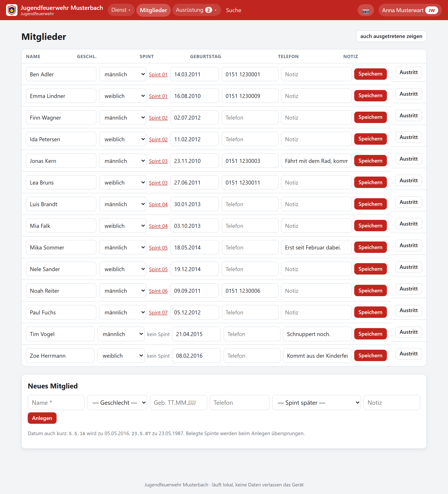

Das Geburtsdatum nimmt Kurzformen: `5.5.16` wird zu `05.05.2016`, `23.5.87` zu `23.05.1987`.
Das Geschlecht steuert, in welchen Umkleidebereich der Spint gehört — legt man das erste
Mädel an, fragt die Software einmal, wie das gehandhabt werden soll, und weiß es danach.

---

## Am Handy

Die Software ist für das Handy gebaut, nicht dafür angepasst: am Übungsabend steht niemand
mit einem Laptop in der Umkleide.

| Anwesenheit | Ein Spint | Nach dem Scannen |
|---|---|---|
| 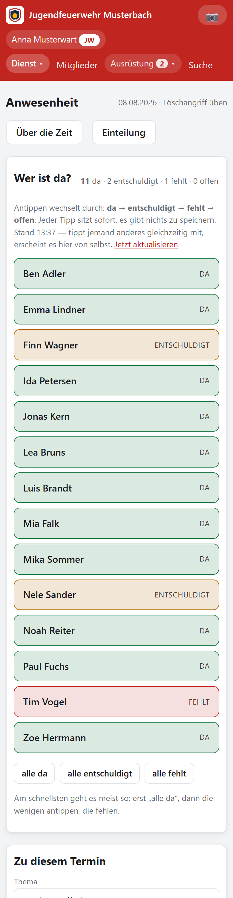 | 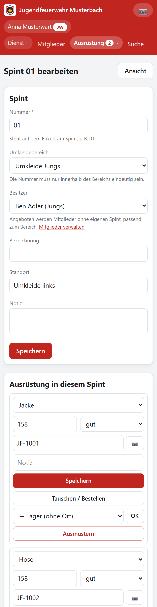 | 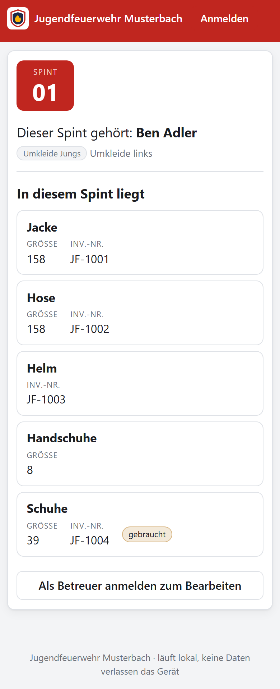 |

Der Barcode-Scan läuft über die Handykamera. Dafür braucht der Browser einen „sicheren
Kontext", also **HTTPS** — `install-pi.sh` stellt darum ein Zertifikat aus. Beim ersten
Aufruf warnt der Browser einmal, weil es selbstsigniert ist; danach ist Ruhe.

Die Darstellung folgt der Einstellung des Geräts. Wer sein Handy dunkel gestellt hat, bekommt
die Seiten dunkel:

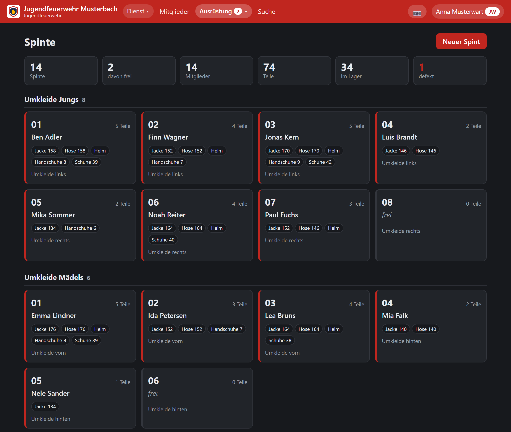

---

## Verwaltung

Die folgenden Seiten sieht nur der **Jugendwart**. Betreuer pflegen Spinte, Ausrüstung,
Mitglieder und Arten; Zugänge, Rollen und Systemdinge bleiben beim Jugendwart. Es muss immer
mindestens ein aktiver Jugendwart übrig bleiben — die Software verhindert, dass sich die Wehr
aussperrt.

### Stammdaten

Name der Wehr, Abteilung, Leitspruch, Logo — und die Zeiten des Übungsabends.

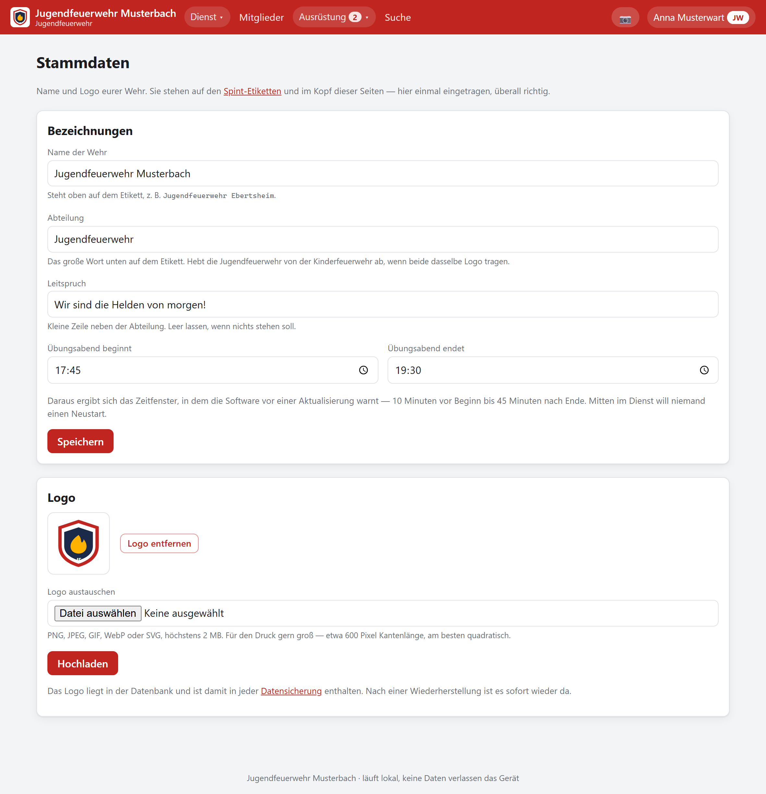

Aus Beginn und Ende ergibt sich das Fenster, in dem die Software vor einem Neustart warnt:
10 Minuten davor bis 45 Minuten danach. Verboten wird nichts, aber mitten im Dienst will
niemand überrascht werden.

Das Logo (PNG, JPEG, GIF, WebP oder SVG) liegt **in der Datenbank**, nicht als Datei daneben.
Damit steckt es in jeder Sicherung und ist nach einer Wiederherstellung sofort wieder da.

### Betreuer

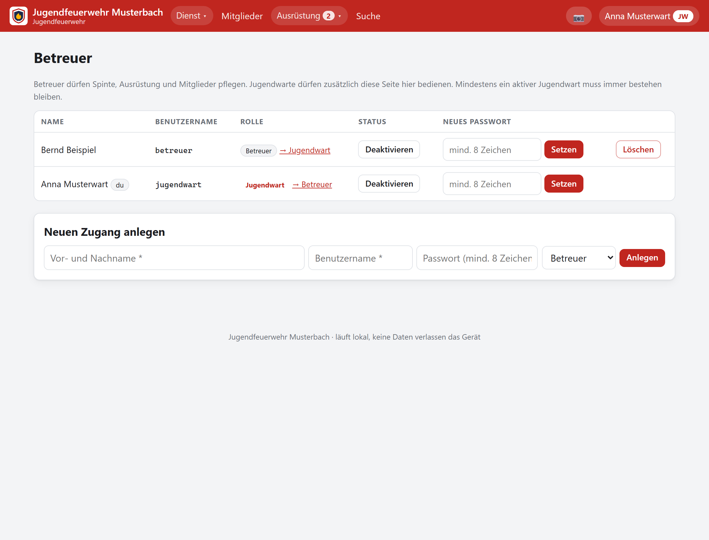

### Datensicherung

Alles, was zählt, steckt in einer Datei — Mitglieder, Spinte, Ausrüstung, Aufgaben,
Anwesenheit, Einschätzungen, Logo.

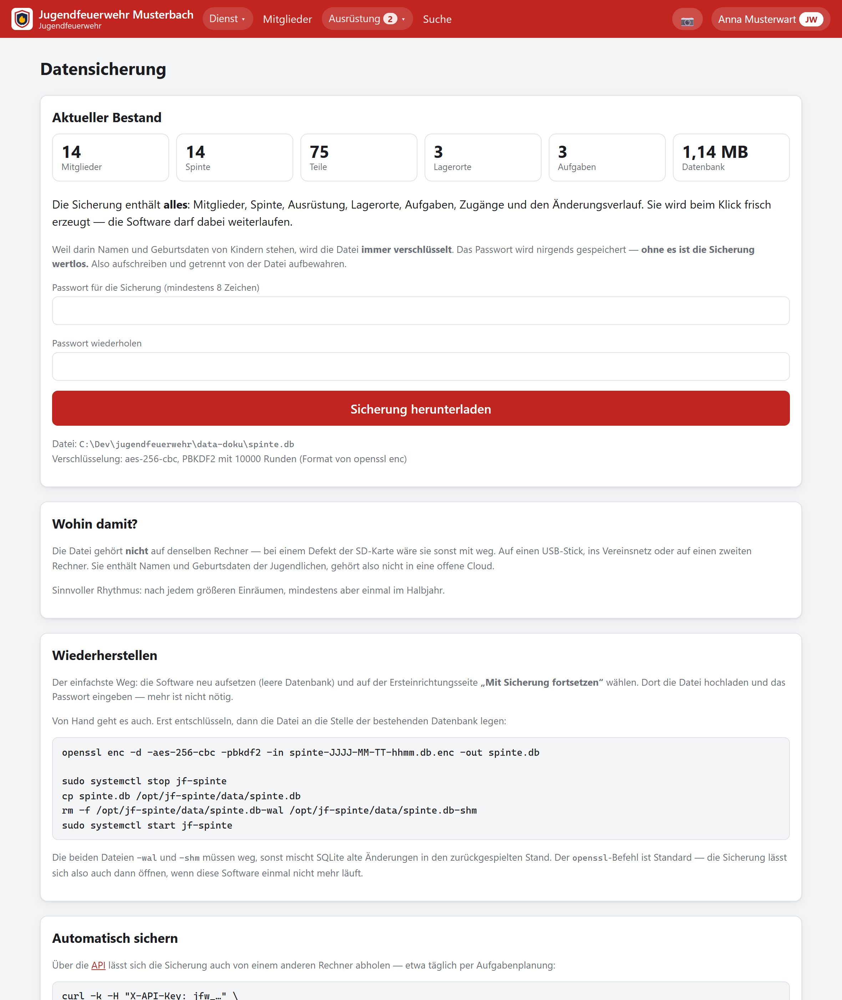

**Immer verschlüsselt.** Es gibt keinen Knopf für eine unverschlüsselte Kopie. In der Datei
stehen Namen, Geburtsdaten und Einschätzungen von Kindern; die soll man ohne Sorge auf einen
USB-Stick oder in eine Cloud legen können. Das Format ist das von `openssl enc`
(AES-256-CBC, PBKDF2) — eine Sicherung, die nur das eigene Programm lesen kann, ist im
Ernstfall keine:

```bash
openssl enc -d -aes-256-cbc -pbkdf2 -in spinte-2026-08-08-2241.db.enc -out spinte.db
```

Drei Wege: über diese Seite, nachts von selbst auf einen USB-Stick, oder per Doppelklick vom
Windows-Rechner.

### System, Update und Herunterfahren

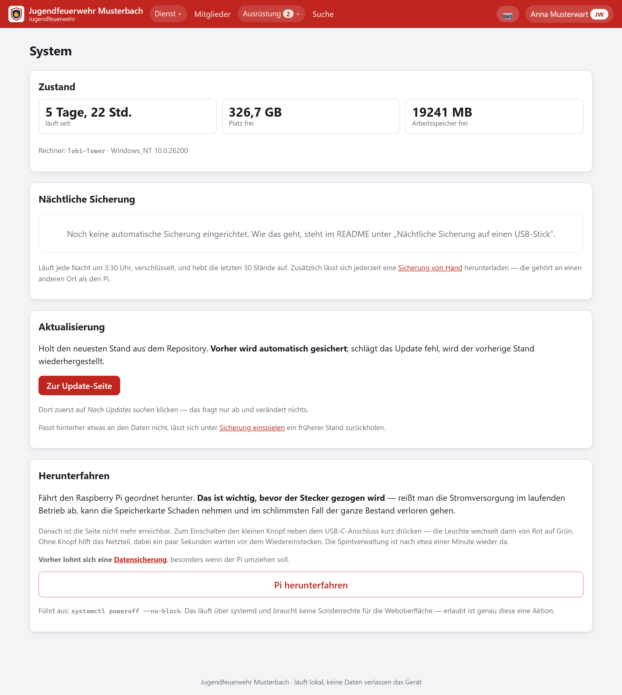

**Herunterfahren** ist wichtiger, als es aussieht: reißt man dem Pi im Betrieb den Strom
weg, kann die Speicherkarte Schaden nehmen — und damit der ganze Bestand. Die Seite sagt auch,
woran man erkennt, dass er fertig ist (ruhig rote Leuchte).

### Aktualisieren

Die Seite zeigt erst, **was** dazukäme, mit Kurztext je Änderung.

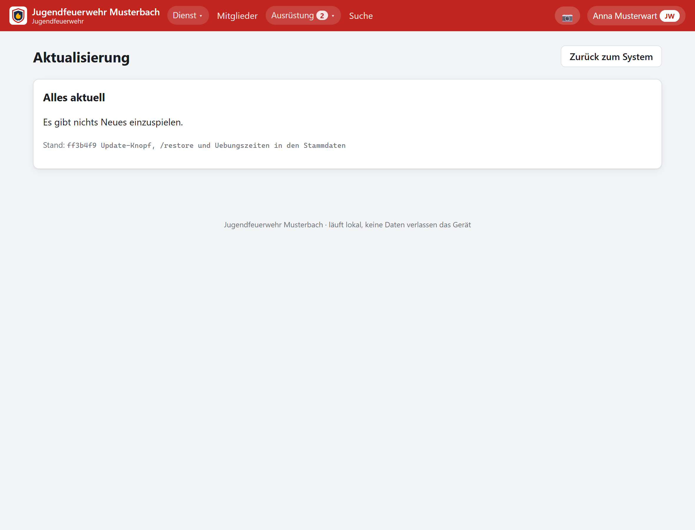

Ein Klick erledigt den Rest: Sicherung ziehen, neuen Stand holen, Abhängigkeiten
installieren, Dienst neu starten, prüfen, ob die Seite antwortet. **Geht etwas schief, setzt
sich das von allein zurück** — nach zwei erfolglosen Versuchen läuft der vorherige Stand
wieder.

Dahinter steckt eine bewusste Aufteilung: die Anwendung kann sich nicht selbst neu starten,
und eine kaputte Anwendung könnte keine Rettungsseite mehr ausliefern. Sie legt darum nur
eine Markierung ab; ein systemd-Wächter startet den eigentlichen Helfer als root **außerhalb**
des Dienstes. Näheres im [README](../README.md#updates-und-was-dabei-zu-beachten-ist).

### Sicherung zurückspielen

Für kaputte Daten — 40 Teile falsch eingebucht, ein Mitglied versehentlich gelöscht.

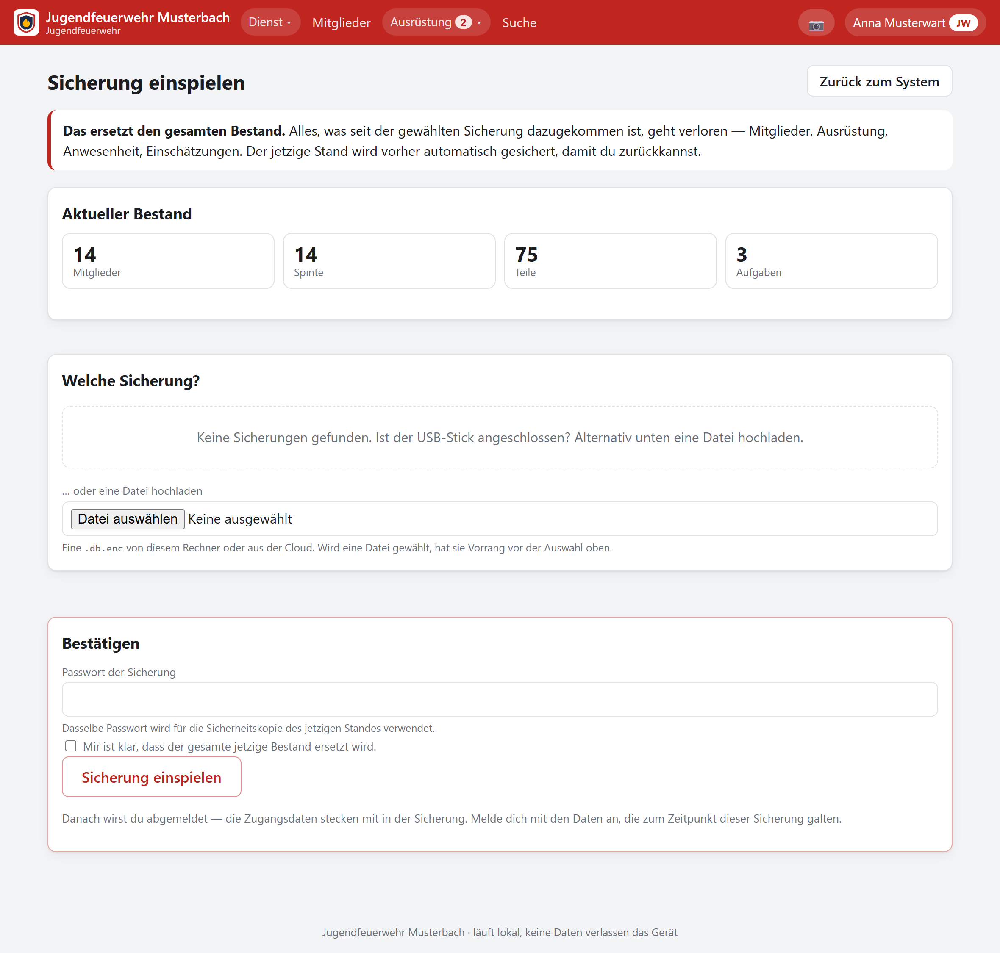

Die Seite listet, was auf dem USB-Stick und auf der Speicherkarte liegt; ist der gewünschte
Stand woanders, lädt man die Datei hoch. Vor dem Ersetzen schreibt die Software den jetzigen
Stand als `…-vor-restore.db.enc` daneben — wer sich in der Datei vergreift, steht nicht ohne
Rückweg da. Danach wird man abgemeldet, denn die Anmeldung stammt aus der ersetzten
Datenbank.

### Schema-Fassung

Jede Sicherung trägt die Fassung des Datenbankschemas — im Dateinamen
(`spinte-2026-08-08-2012-s1.db.enc`) und in der Datei selbst. Beim Einspielen
wird verglichen:

* **Ältere** Sicherung → wird eingespielt und auf den aktuellen Stand gehoben.
* **Neuere** Sicherung → wird abgelehnt. Erst die Software aktualisieren.

Ohne diesen Vergleich fielen beim Einspielen einer neueren Sicherung genau die
Spalten weg, die die ältere Software noch nicht kennt — ohne Fehler, ohne
Meldung. Einzelheiten in [Datenbank und Schema-Fassungen](datenbank.md).

### API-Zugänge

Für andere Systeme: lesender oder schreibender Zugriff per Token. Gespeichert wird nur der
Hash — im Klartext bekommt man den Token genau einmal zu sehen.

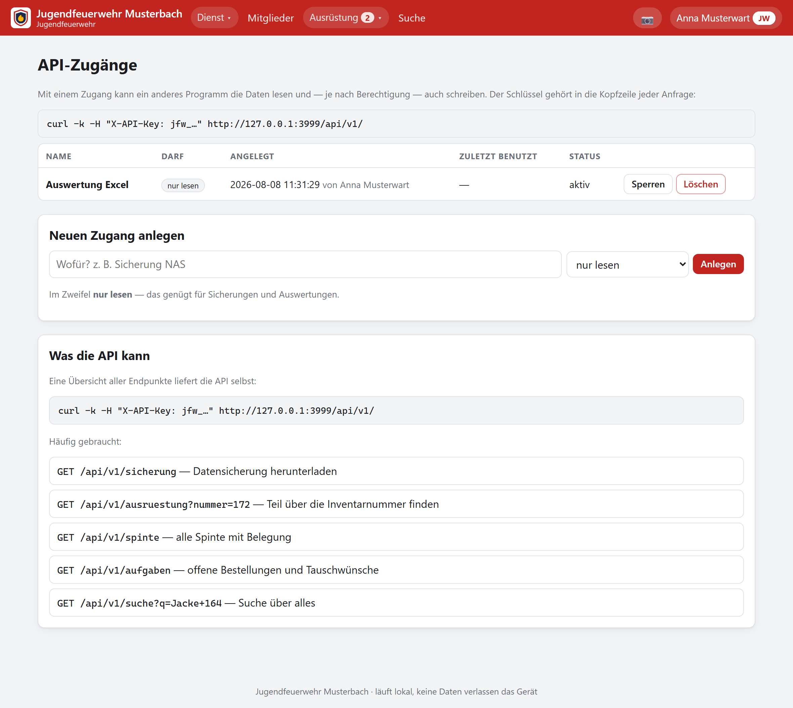

### Änderungsverlauf

Wer hat wann was geändert. Nicht als Überwachung, sondern damit sich Fragen wie „wo ist die
Jacke 158 hin?" beantworten lassen.

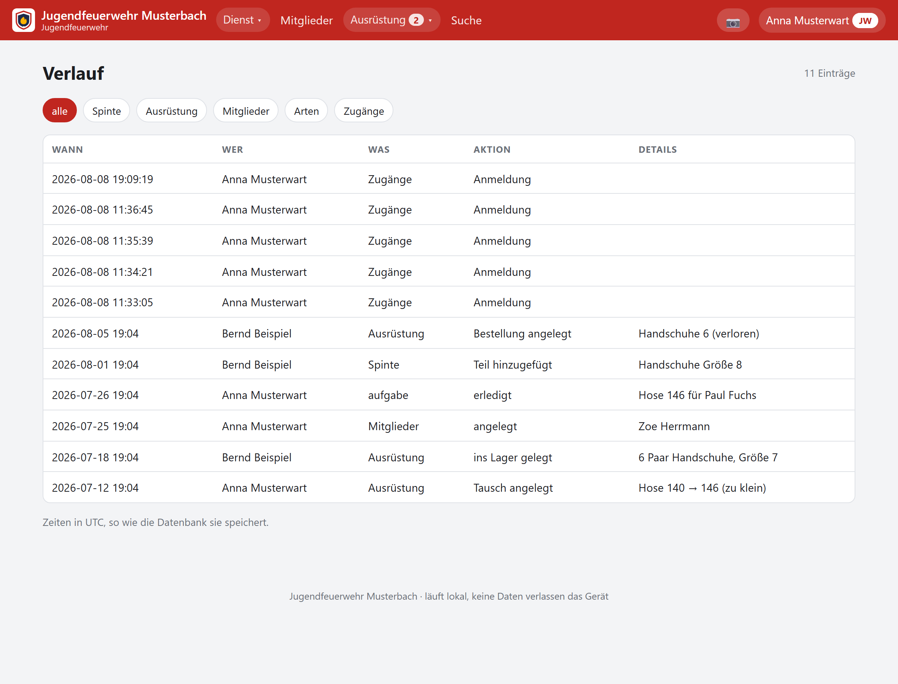

---

## Dieses Handbuch in der Software

Das Handbuch liegt nicht nur hier im Repository, sondern auch **in der laufenden
Installation**: unter *eigener Name → Handbuch*. Es wandert mit jedem Update
mit, die laufende Fassung zeigt also immer das Handbuch, das zu ihr gehört —
kein veralteter Ausdruck im Ordner, und im Gerätehaus ohne Netz funktioniert es
auch.

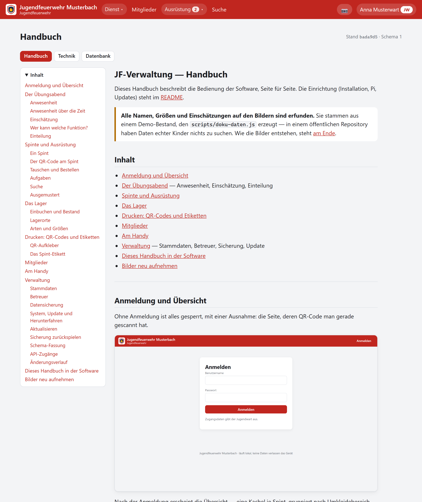

Oben stehen der Stand der Software und die Schema-Fassung. Über die drei
Schaltflächen kommt man zu den beiden anderen Dokumenten: der technischen
Beschreibung (dem README) und der Beschreibung der Datenbank-Fassungen.
Sichtbar ist das nur für Angemeldete.

## Bilder neu aufnehmen

Alle Bilder dieser Seite entstehen automatisch. Nach einer Änderung an der Oberfläche:

```bash
node scripts/doku-daten.js --force
```

```bash
node scripts/doku-bilder.js
```

Das erste Skript legt den Demo-Bestand in `data-doku/` an (14 erfundene Kinder, 14 Spinte,
75 Teile, sieben Übungsabende — absichtlich „gebraucht", mit offenen Aufgaben und halb
gefüllten Spinten; auf leeren Seiten sieht man nicht, was die Software kann).

Das zweite startet den Server auf diesem Bestand und steuert Chrome im Kopflos-Modus über das
DevTools-Protokoll. Ohne zusätzliche Abhängigkeit: Node bringt seit Fassung 22 einen
WebSocket mit, und mehr braucht das Protokoll nicht. Die Bilder landen in `docs/bilder/`.

`data-doku/` steht in `.gitignore` — der Demo-Bestand selbst wird nicht mitgeliefert, nur das
Skript, das ihn erzeugt.
